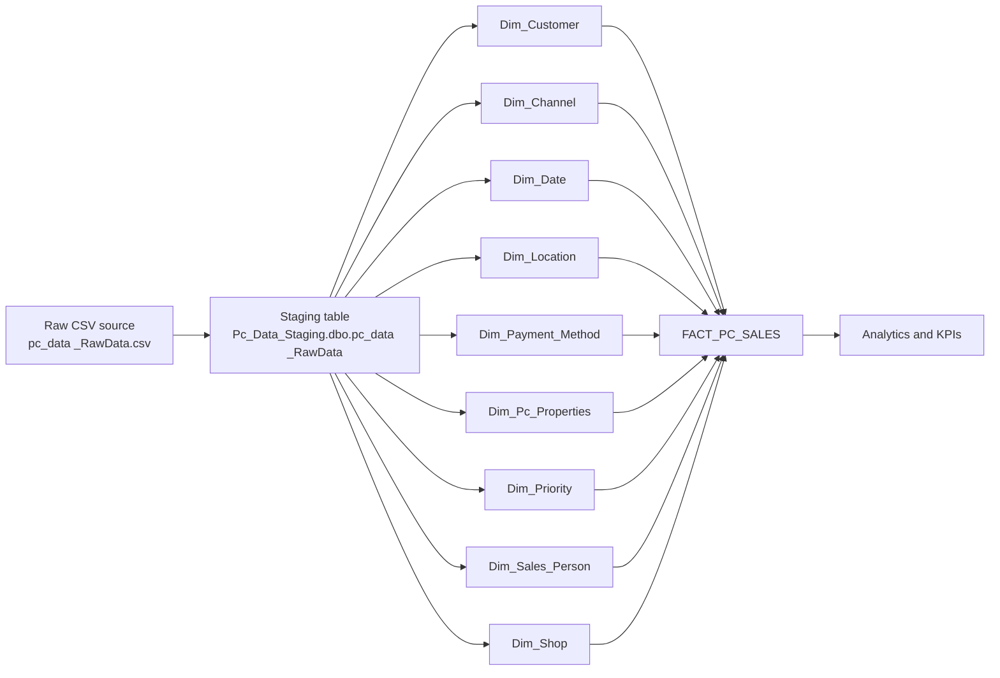

# Data_Architect_Pc_Data

## Project Overview

`Data_Architect_Pc_Data` is a PC sales data engineering repository that demonstrates how to build a star-schema data warehouse from raw CSV sales data. The solution includes data modeling, dimension table creation, fact table loading, stored procedures, and support for SQL Server Agent automation.

The goal is to transform raw sales records into a query-ready analytics dataset for reporting on customers, sales channels, product properties, payments, locations, shop performance, sales people, priorities, and time.

## Repository Architecture

### Core layers

- **Source data**: CSV files in `csv_RawData_n_Grouped_Data/`
- **Dimension modeling**: SQL scripts in `All_Dimension_Table/`
- **Stored procedures**: `Stored_procedure/` contains reusable ETL procedures
- **Star schema diagram**: `Star_Schemer/Star_Schemer.png`
- **Automation support**: `SQL Server Agent/Enabling_the sql server agent.sql`

---

## Technologies Used

- Microsoft SQL Server / T-SQL
- SQL Server Management Studio (SSMS)
- CSV data files for source input
- Star schema data modeling
- Windows-compatible SQL Server Agent job scheduling
- SQL stored procedures for ETL orchestration
- Basic file-based data staging with CSV + database objects

---

## Files and Folders

| Folder | Purpose | Key Files |
|---|---|---|
| [`csv_RawData_n_Grouped_Data/`](csv_RawData_n_Grouped_Data/) | Raw and prepared CSV datasets plus the data-model diagram | `pc_data _RawData.csv`, `pc_data_Modelling.csv`, `Completed_Data_Modelling_Pc_Data.png` |
| [`All_Dimension_Table/`](All_Dimension_Table/) | SQL definitions for dimension tables and fact table | `Dim_Customer.sql`, `Dim_Channel.sql`, `dim_Date.sql`, `DIM_LOCATION.sql`, `Dim_PaymentMethod.sql`, `Dim_Pc_properties.sql`, `Dim_Priority.sql`, `Dim_Sales_Person.sql`, `Dim_Shop.sql`, `Fact_Pc_Sales.sql` |
| [`Stored_procedure/`](Stored_procedure/) | Stored procedures to create and populate dimensions and fact | `create_dim_customer.sql`, `create_dim_channel.sql`, `create_dim_date.sql`, `create_dim_Location.sql`, `create_dim_PaymentMethode.sql`, `create_dim_properties.sql`, `create_dim_priority.sql`, `create_dim_sales_person.sql`, `create_dim_shop.sql`, `create_sp_Fact_Sales.sql` |
| [`Star_Schemer/`](Star_Schemer/) | Visual star schema layout | `Star_Schemer.png` |
| [`SQL Server Agent/`](SQL%20Server%20Agent/) | SQL Server Agent enablement script | `Enabling_the sql server agent.sql` |

---

## Data Model Summary

This project is built around a **star schema**:

- Central fact table: `FACT_PC_SALES`
- Dimension tables:
  - `Dim_Customer`
  - `Dim_Channel`
  - `Dim_Date`
  - `Dim_Location`
  - `Dim_Payment_Method`
  - `Dim_Pc_Properties`
  - `Dim_Priority`
  - `Dim_Sales_Person`
  - `Dim_Shop`

### Fact table key columns

`FACT_PC_SALES` stores the following foreign keys and business measures:

- `Customer_ID`
- `Channel_ID`
- `Properies_ID`
- `Payment_Method_ID`
- `PriorityID`
- `Sales_Person_ID`
- `DateID`
- `Shop_ID`
- `LocationID`
- `Cost_Price`
- `Sale_Price`
- `Discount_Amount`
- `Finance_Amount`
- `Credit_Score`
- `Cost_of_Repairs`
- `Total_Sales_per_Employee`
- `PC_Market_Price`

### Dimension purpose map

| Dimension | Business context |
|---|---|
| `Dim_Customer` | Customer identity and contact details |
| `Dim_Channel` | Sales channel or distribution source |
| `Dim_Date` | Purchase and ship dates |
| `Dim_Location` | Geography: continent, country/state, city/province |
| `Dim_Payment_Method` | Payment type used in the sale |
| `Dim_Pc_Properties` | Product attributes: make, model, RAM, storage |
| `Dim_Priority` | Sales priority level |
| `Dim_Sales_Person` | Sales representative and department |
| `Dim_Shop` | Retail shop metadata |

---

## ETL Flow

1. Import `csv_RawData_n_Grouped_Data/pc_data _RawData.csv` into a staging table, typically under the `Pc_Data_Staging` database.
2. Create dimension tables from distinct attribute values using scripts in `All_Dimension_Table/` or the equivalent procedures in `Stored_procedure/`.
3. Load `FACT_PC_SALES` by joining raw staging rows to all dimensions using natural business keys.
4. Validate the loaded fact table and run reporting queries.
5. Optionally schedule refresh jobs through SQL Server Agent using `SQL Server Agent/Enabling_the sql server agent.sql`.

### ETL diagram



---

## Sample SQL Code

### 1. Dimension table creation

Example: `Dim_Customer.sql`

```sql
CREATE TABLE [Pc_Data_Staging].[dbo].[Dim_Customer](
    [Customer_ID] [int] IDENTITY(1,1) PRIMARY KEY,
    [Customer_Name] [nvarchar](50) NOT NULL,
    [Customer_Surname] [nvarchar](50) NOT NULL,
    [Customer_Contact_Number] [nvarchar](50) NOT NULL,
    [Customer_Email_Address] [nvarchar](50) NOT NULL
);

INSERT INTO [Pc_Data_Staging].[dbo].[Dim_Customer] (
    [Customer_Name],
    [Customer_Surname],
    [Customer_Contact_Number],
    [Customer_Email_Address]
)
SELECT DISTINCT
    [Customer_Name],
    [Customer_Surname],
    [Customer_Contact_Number],
    [Customer_Email_Address]
FROM [Pc_Data_Staging].[dbo].[pc_data _RawData];
```

### 2. Fact table creation and load

Example: `Fact_Pc_Sales.sql`

```sql
CREATE TABLE [dbo].[FACT_PC_SALES](
    [Sales_ID] [int] IDENTITY(1,1) PRIMARY KEY,
    [Customer_ID] [int] NOT NULL,
    [Channel_ID] [int] NOT NULL,
    [Properies_ID] [int] NOT NULL,
    [Payment_Method_ID] [int] NOT NULL,
    [PriorityID] [int] NOT NULL,
    [Sales_Person_ID] [int] NOT NULL,
    [DateID] [INT] NOT NULL,
    [Shop_ID] [int] NOT NULL,
    [LocationID] [int] NOT NULL,
    [Cost_Price] [int] NOT NULL,
    [Sale_Price] [int] NOT NULL,
    [Discount_Amount] [int] NOT NULL,
    [Finance_Amount] [nvarchar](50) NOT NULL,
    [Credit_Score] [int] NOT NULL,
    [Cost_of_Repairs] [nvarchar](50) NOT NULL,
    [Total_Sales_per_Employee] [int] NOT NULL,
    [PC_Market_Price] [int] NOT NULL
);

INSERT INTO [dbo].[FACT_PC_SALES] (
    [Customer_ID],
    [Channel_ID],
    [Payment_Method_ID],
    [Properies_ID],
    [PriorityID],
    [Sales_Person_ID],
    [DateID],
    [Shop_ID],
    [LocationID],
    [Cost_Price],
    [Sale_Price],
    [Discount_Amount],
    [Finance_Amount],
    [Credit_Score],
    [Cost_of_Repairs],
    [Total_Sales_per_Employee],
    [PC_Market_Price]
)
SELECT DISTINCT
    a.[Customer_ID],
    b.[Channel_ID],
    c.[Payment_Method_ID],
    d.[Properies_ID],
    e.[PriorityID],
    f.[Sales_Person_ID],
    g.[DateID],
    h.[Shop_ID],
    i.[LocationID],
    s.[Cost_Price],
    s.[Sale_Price],
    s.[Discount_Amount],
    s.[Finance_Amount],
    s.[Credit_Score],
    s.[Cost_of_Repairs],
    s.[Total_Sales_per_Employee],
    s.[PC_Market_Price]
FROM [Pc_Data_Staging].[dbo].[pc_data _RawData] AS s
JOIN [dbo].[Dim_Customer] AS a
    ON s.Customer_Name = a.Customer_Name
    AND s.Customer_Surname = a.Customer_Surname
    AND s.Customer_Contact_Number = a.Customer_Contact_Number
    AND s.Customer_Email_Address = a.Customer_Email_Address
JOIN [dbo].[Dim_Channel] AS b
    ON s.Channel = b.Channel
JOIN [dbo].[Dim_Payment_Method] AS c
    ON s.Payment_Method = c.Payment_Method
JOIN [dbo].[Dim_Pc_Properties] AS d
    ON s.PC_Make = d.PC_Make
    AND s.PC_Model = d.PC_Model
    AND s.Storage_Type = d.Storage_Type
    AND s.RAM = d.RAM
    AND s.Storage_Capacity = d.Storage_Capacity
JOIN [dbo].[Dim_Priority] AS e
    ON s.Priority = e.priority
JOIN [dbo].[Dim_Sales_Person] AS f
    ON s.Sales_Person_Name = f.Sales_Person_Name
    AND s.Sales_Person_Department = f.Sales_Person_Department
JOIN [dbo].[Dim_Date] AS g
    ON s.Purchase_Date = g.Purchase_Date
    AND s.Ship_Date = g.Ship_Date
JOIN [dbo].[Dim_Shop] AS h
    ON s.Shop_Name = h.Shop_Name
    AND s.Shop_Age = h.Shop_Age
JOIN [dbo].[Dim_Location] AS i
    ON s.Continent = i.continent
    AND s.Country_or_State = i.Country_or_State
    AND s.Province_or_City = i.Province_or_City;
```

### 3. Stored procedure to build the fact table

Example: `Stored_procedure/create_sp_Fact_Sales.sql`

```sql
CREATE PROCEDURE sp_create_Fact_Pc_Sales
AS
BEGIN
    CREATE TABLE [Pc_Data_Staging].[dbo].[FACT_PC_SALES](
        [Sales_ID] [int] IDENTITY(1,1) PRIMARY KEY,
        [Customer_ID] [int] NOT NULL,
        [Channel_ID] [int] NOT NULL,
        [Properies_ID] [int] NOT NULL,
        [Payment_Method_ID] [int] NOT NULL,
        [PriorityID] [int] NOT NULL,
        [Sales_Person_ID] [int] NOT NULL,
        [DateID] [INT] NOT NULL,
        [Shop_ID] [int] NOT NULL,
        [LocationID] [int] NOT NULL,
        [Cost_Price] [int] NOT NULL,
        [Sale_Price] [int] NOT NULL,
        [Discount_Amount] [int] NOT NULL,
        [Finance_Amount] [nvarchar](50) NOT NULL,
        [Credit_Score] [int] NOT NULL,
        [Cost_of_Repairs] [nvarchar](50) NOT NULL,
        [Total_Sales_per_Employee] [int] NOT NULL,
        [PC_Market_Price] [int] NOT NULL
    );

    INSERT INTO [dbo].[FACT_PC_SALES] (
        [Customer_ID],
        [Channel_ID],
        [Payment_Method_ID],
        [Properies_ID],
        [PriorityID],
        [Sales_Person_ID],
        [DateID],
        [Shop_ID],
        [LocationID],
        [Cost_Price],
        [Sale_Price],
        [Discount_Amount],
        [Finance_Amount],
        [Credit_Score],
        [Cost_of_Repairs],
        [Total_Sales_per_Employee],
        [PC_Market_Price]
    )
    -- join logic omitted for brevity; see Stored_procedure/create_sp_Fact_Sales.sql
    SELECT DISTINCT ...
    FROM [Pc_Data_Staging].[dbo].[pc_data _RawData] AS s
    JOIN ...
END;
```

---

## How to Use this Project

### Prerequisites

- Microsoft SQL Server
- SQL Server Management Studio (SSMS)
- Access to the CSV files in `csv_RawData_n_Grouped_Data/`
- A database for staging, e.g. `Pc_Data_Staging`

### Deployment steps

1. Open `csv_RawData_n_Grouped_Data/pc_data _RawData.csv` and import it into a staging table.
2. Run the dimension creation scripts in `All_Dimension_Table/` in this order:
   - `Dim_Customer.sql`
   - `Dim_Channel.sql`
   - `dim_Date.sql`
   - `DIM_LOCATION.sql`
   - `Dim_PaymentMethod.sql`
   - `Dim_Pc_properties.sql`
   - `Dim_Priority.sql`
   - `Dim_Sales_Person.sql`
   - `Dim_Shop.sql`
3. Execute `All_Dimension_Table/Fact_Pc_Sales.sql` to create and populate the fact table.
4. If preferred, run stored procedures in `Stored_procedure/` instead of raw SQL table creation.
5. Review the star schema in `Star_Schemer/Star_Schemer.png` and the data model in `csv_RawData_n_Grouped_Data/Completed_Data_Modelling_Pc_Data.png`.
6. Use `SQL Server Agent/Enabling_the sql server agent.sql` to automate the pipeline.

---

## Recommended Validation Queries

- Count rows in each dimension and fact table
- Check for unmatched staging rows or missing dimension keys
- Compare totals in `Sale_Price`, `Cost_Price`, and `Discount_Amount` with source CSV totals
- Verify distinct counts of customers, products, shops, and sales people

---

## Notes

- The repository follows a typical **data warehouse star schema** pattern.
- The fact table ties transactional sales metrics to dimensional business context.
- Stored procedures are provided for repeatable ETL execution.
- The `SQL Server Agent` script is included for scheduling and operationalization.

---

## Quick Links

- [Raw CSV source](csv_RawData_n_Grouped_Data/pc_data%20_RawData.csv)
- [Prepared model dataset](csv_RawData_n_Grouped_Data/pc_data_Modelling.csv)
- [Star schema diagram](Star_Schemer/Star_Schemer.png)
- [Data model diagram](csv_RawData_n_Grouped_Data/Completed_Data_Modelling_Pc_Data.png)
- [Enable SQL Server Agent](SQL%20Server%20Agent/Enabling_the%20sql%20server%20agent.sql)
- [Fact table script](All_Dimension_Table/Fact_Pc_Sales.sql)
- [Stored procedure for fact load](Stored_procedure/create_sp_Fact_Sales.sql)

